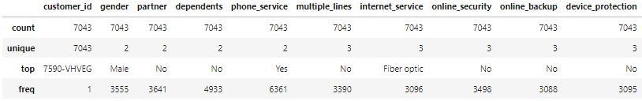
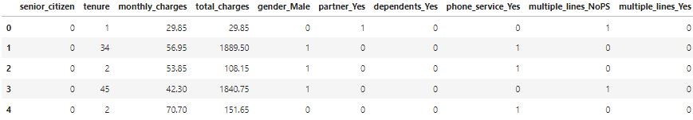
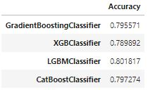

# Тестирование алгоритмов бустинга


```python
# Импорт основных библиотек
import numpy as np
import pandas as pd

# Импорт библиотеки машинного обучения
from sklearn.model_selection import train_test_split
from sklearn.model_selection import GridSearchCV
from sklearn.preprocessing import MinMaxScaler
from sklearn.metrics import accuracy_score, roc_auc_score
from sklearn.ensemble import GradientBoostingClassifier
from xgboost import XGBClassifier
from lightgbm import LGBMClassifier
from catboost import CatBoostClassifier

# Импорт библиотек построения графиков и диаграмм
from matplotlib import pyplot as plt
import seaborn as sns

# Указание режима отображения диаграмм
%matplotlib inline

# Настройка параметров среды Pandas
pd.set_option("display.max_columns", 200)
```
### Загрузка исходных данных
```python
# Загрузка исходных данных об оттоке клиентов в компании Telcom
telcom_df = pd.read_csv('telco-customer-churn.csv')

# Вывод загруженных данных
telcom_df.head()
```


```python
# Задание удобных наименований признакам
telcom_df.columns = ['customer_id', 'gender', 'senior_citizen', 'partner', 'dependents', 'tenure', 'phone_service',
                     'multiple_lines', 'internet_service', 'online_security', 'online_backup', 'device_protection',
                     'tech_support', 'streaming_tv', 'streaming_movies', 'contract', 'paperless_billing',
                     'payment_method', 'monthly_charges', 'total_charges', 'churn']
```

### Разведочный анализ данных
```python
# Сводная информация о структуре исходных данных
telcom_df.info()
```
```
<class 'pandas.core.frame.DataFrame'>
RangeIndex: 7043 entries, 0 to 7042
Data columns (total 21 columns):
 #   Column             Non-Null Count  Dtype  
---  ------             --------------  -----  
 0   customer_id        7043 non-null   object 
 1   gender             7043 non-null   object 
 2   senior_citizen     7043 non-null   int64  
 3   partner            7043 non-null   object 
 4   dependents         7043 non-null   object 
 5   tenure             7043 non-null   int64  
 6   phone_service      7043 non-null   object 
 7   multiple_lines     7043 non-null   object 
 8   internet_service   7043 non-null   object 
 9   online_security    7043 non-null   object 
 10  online_backup      7043 non-null   object 
 11  device_protection  7043 non-null   object 
 12  tech_support       7043 non-null   object 
 13  streaming_tv       7043 non-null   object 
 14  streaming_movies   7043 non-null   object 
 15  contract           7043 non-null   object 
 16  paperless_billing  7043 non-null   object 
 17  payment_method     7043 non-null   object 
 18  monthly_charges    7043 non-null   float64
 19  total_charges      7043 non-null   object 
 20  churn              7043 non-null   object 
dtypes: float64(1), int64(2), object(18)
memory usage: 1.1+ MB
```

```python
# Вывод основных статистик по количественным признакам
telcom_df.describe(include=[np.number])
```


```python
# Вывод основных статистик по категориальным и строковым признакам
telcom_df.describe(include=[np.object])
```


```python
# Удаление признака "customer_id" из исходных данных, поскольку признак не несёт никакой информации
telcom_df.drop(columns=['customer_id'], inplace=True)

# Преобразование признака "total_charges" в числовой тип
telcom_df.total_charges = pd.to_numeric(telcom_df.total_charges, errors='coerce').fillna(0)

# Определение зависимостей в количественных признаках, через отображение парных отношений признаков и их распределение
sns.pairplot(telcom_df, hue='churn', diag_kind='hist', height=2)

# Вывод диаграммы
plt.show()
```


```python
# Преобразование категориальных признаков в бинарные признаки
telcom_df = pd.get_dummies(telcom_df, columns=telcom_df.columns[telcom_df.dtypes==object], drop_first=True)

# Задание удобных наименований признакам
column_list = {'multiple_lines_No phone service': 'multiple_lines_NoPS', 'internet_service_Fiber optic': 'internet_service_FO',
               'online_security_No internet service': 'online_security_NoIS', 'online_backup_No internet service': 'online_backup_NoIS', 
               'device_protection_No internet service': 'device_protection_NoIS', 'tech_support_No internet service': 'tech_support_NoIS',
               'streaming_tv_No internet service': 'streaming_tv_NoIS', 'streaming_movies_No internet service': 'streaming_movies_NoIS',
               'contract_One year': 'contract_1Y', 'contract_Two year': 'contract_2Y', 'payment_method_Credit card (automatic)': 'payment_method_Card',
               'payment_method_Electronic check': 'payment_method_ECheck', 'payment_method_Mailed check': 'payment_method_Mail'}
telcom_df.rename(columns=column_list, inplace=True)

# Вывод новых признаков
telcom_df.head()
```


```python
# Создание цветовой карты для подсвечивания сильных связей
color_map = sns.color_palette(['#d7301f', '#fcae91', '#f7f7f7', '#f7f7f7', '#f7f7f7', '#f7f7f7', '#9ecae1', '#08519c'])

# Определение размера диаграммы
plt.figure(figsize=(20, 14))

# Вывод матрицы корреляции с линейными коэффициентами Пирсона для оценки степени линейной зависимости между признаками
ax = sns.heatmap(
    telcom_df.corr(), cmap=color_map, square=True, vmin=-1, vmax=1, center= 0,
    linewidths=0.1, linecolor='white', annot=True, fmt='.1g', 
    cbar_kws=dict(ticks=np.arange(-1.0, 1.1, 0.25), aspect=25))

# Вывод диаграммы
plt.show()
```

В соответствии с полученной матрицей корреляции можно сказать, что в результате применения бинарного кодирования к категориальным значениям, полученный набор признаков избыточен. То есть 6-ть идентичных признаков: **online_security_NoIS**, **online_backup_NoIS**, **device_protection_NoIS**, **tech_support_NoIS**, **streaming_tv_NoIS**, **streaming_movies_NoIS** можно удалить. Они полностью дублируют информацию, отраженную в признаке **internet_service_No**. Также наличие признака **multiple_lines_NoPS** является лишним, поскольку признаки **multiple_lines_NoPS** и **phone_service_Yes** взаимоисключающие.

```python
# Удаление признаков идентичных признаку "internet_service_No"
telcom_df = telcom_df.drop(columns=['online_security_NoIS', 'online_backup_NoIS', 'device_protection_NoIS', 'tech_support_NoIS', 'streaming_tv_NoIS', 'streaming_movies_NoIS'])

# Удаление признака идентичного признаку "phone_service_Yes"
telcom_df.drop(columns=['multiple_lines_NoPS'], inplace=True)
```
### Предобработка данных
```python
# Определение тренировочной и контрольной выборок
X_train, X_test, Y_train, Y_test = train_test_split(
    telcom_df.iloc[:, :-1].values, telcom_df.iloc[:, -1].values, random_state=42)

# Нормализация значений признаков
X_train = MinMaxScaler().fit_transform(X_train)
X_test = MinMaxScaler().fit_transform(X_test)
```

### Построение моделей прогнозирования оттока
##### Модели с базовыми настройками
```python
# Определение алгоритмов градиентного бустинга
models = [GradientBoostingClassifier(random_state=42),
          XGBClassifier(random_state=42, eval_metric='logloss', use_label_encoder=False),
          LGBMClassifier(random_state=42),
          CatBoostClassifier(random_state=42, silent=True)]

# Метрики качества моделей машинного обучения
scores = []

# Оценка моделей машинного обучения
for model in models:
    scores.append(accuracy_score(Y_test, model.fit(X_train, Y_train).predict(X_test)))

# Вывод метрик качества алгоритмов градиентного бустинга
pd.DataFrame({'Accuracy': scores}, index=['GradientBoostingClassifier', 'XGBClassifier', 
                                          'LGBMClassifier', 'CatBoostClassifier'])
```


##### Модели с оптимизацией гиперпараметров
```python
# Гиперпараметры модели машинного обучения
params = {'learning_rate': [0.05, 0.1, 0.3],
          'max_depth':     [1, 5, 16],
          'subsample':     [0.4, 0.8, 1],
          'n_estimators':  [100]}

# Определение алгоритмов градиентного бустинга
models = [GradientBoostingClassifier(random_state=42),
          XGBClassifier(random_state=42, eval_metric='logloss', use_label_encoder=False),
          LGBMClassifier(random_state=42),
          CatBoostClassifier(random_state=42, silent=True)]

# Метрики качества моделей машинного обучения
scores = []

# Оценка моделей машинного обучения
for model in models:
    gs_model = GridSearchCV(model, params, scoring='accuracy', cv=10, n_jobs=-1).fit(X_train, Y_train)
    scores.append(accuracy_score(Y_test, gs_model.best_estimator_.fit(X_train, Y_train).predict(X_test)))

# Вывод метрик качества алгоритмов градиентного бустинга
pd.DataFrame({'Accuracy': scores}, index=['GradientBoostingClassifier', 'XGBClassifier', 
                                          'LGBMClassifier', 'CatBoostClassifier'])
```


### Результаты и выводы
Из полученных результатов видно, что для моделей с базовыми настройками лучший результат показал классификатор **LGBMClassifier** с показателем **Accuracy=0.80**. Те же модели, но с оптимизированными гиперпараметрами примерно показывают одинаковую эффективность.

В данном тесте классификатор **LGBMClassifier** можно считать победителем среди классификаторов "из коробки".
